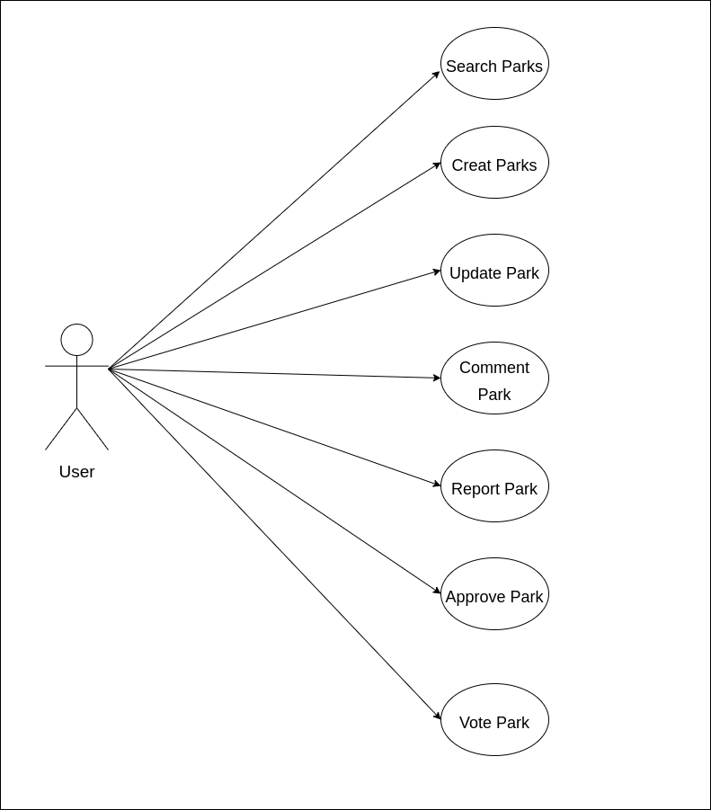
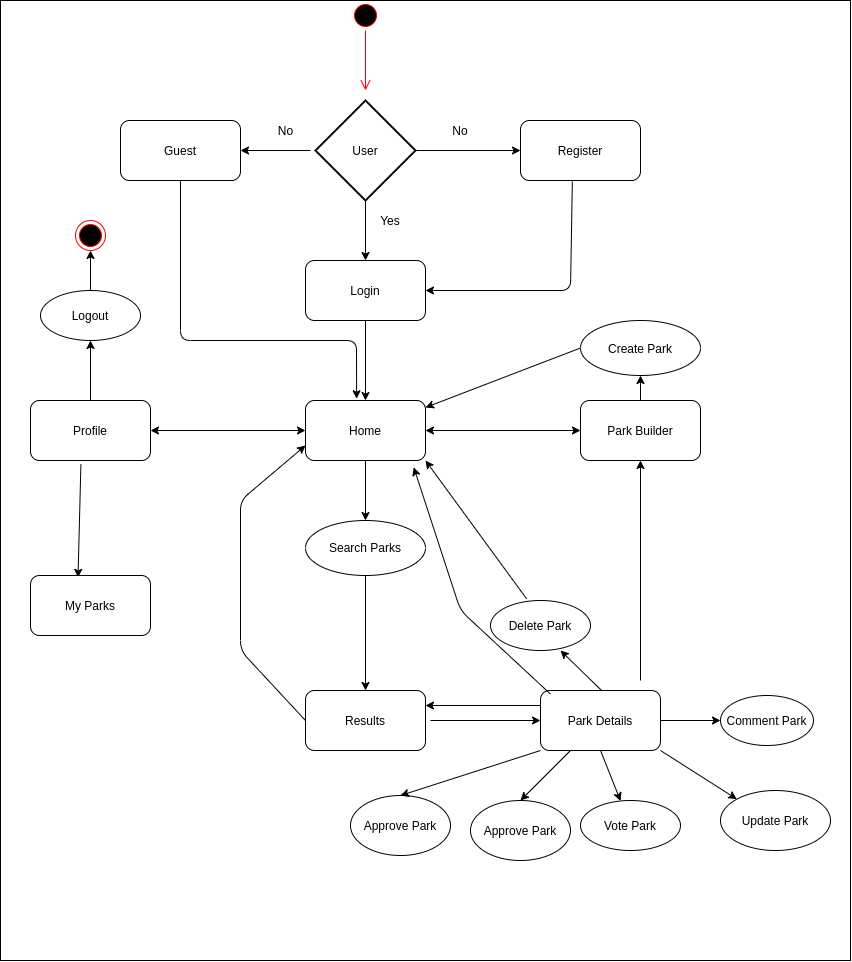
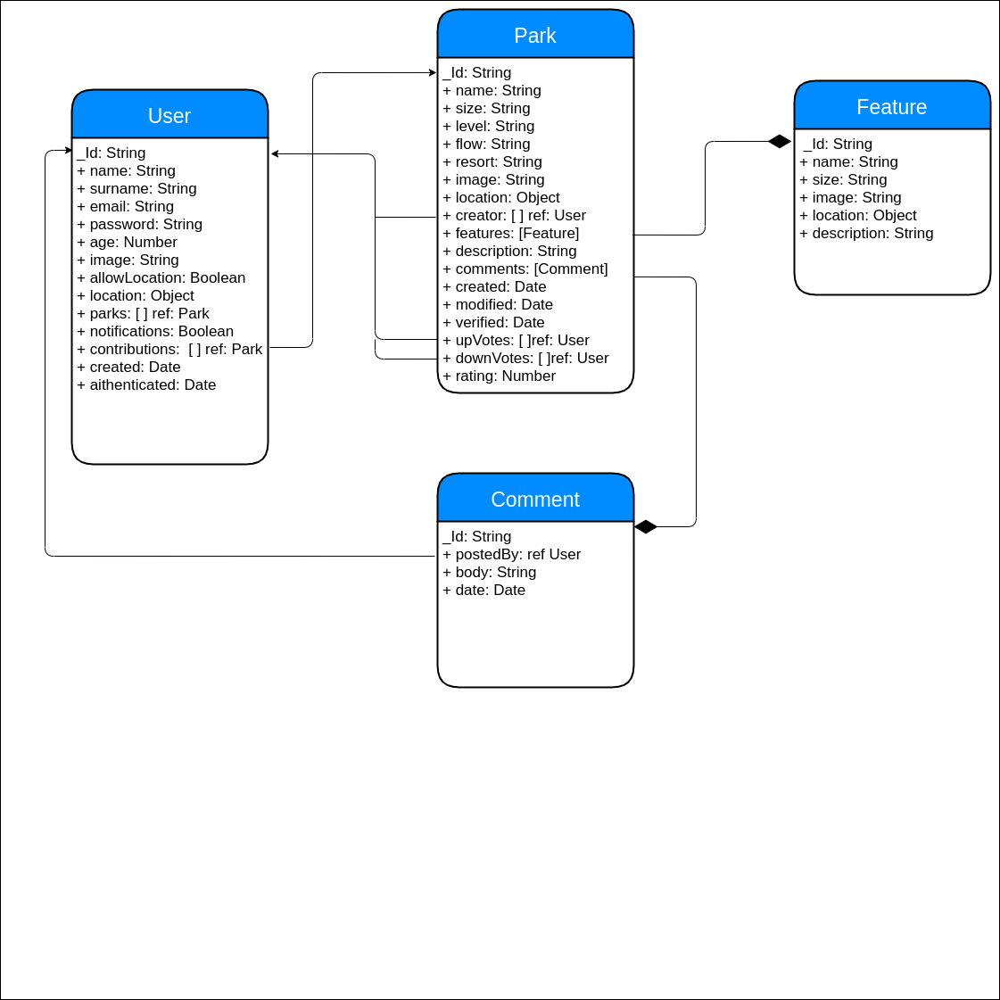
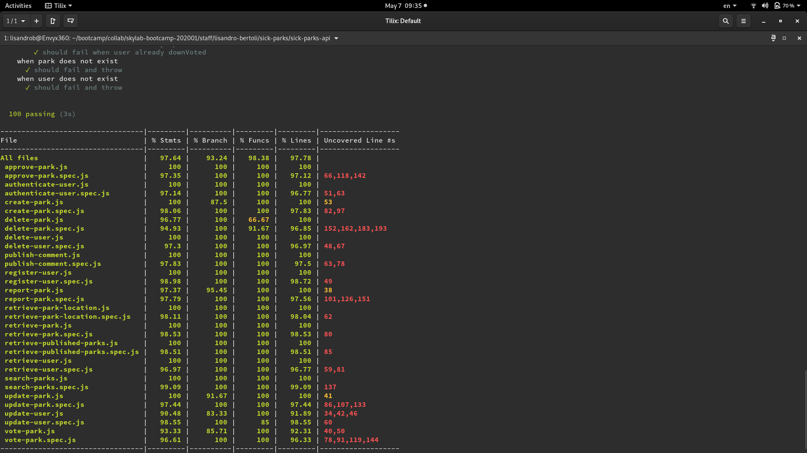
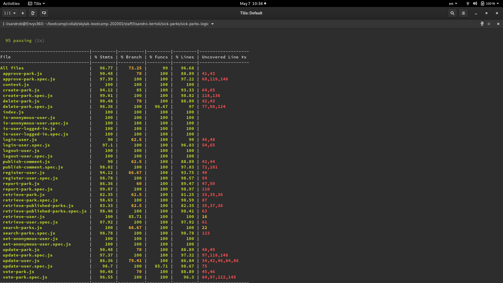

# Sick Parks

## Introduction

Sick Parks was thought taking into account that there are no apps to find detailed information about snowparks around the globe. To solve this, the approach is for the community of snowboarders to be the one that provides the information. In this way the app tries to bring some aspects of the open source into the snwoboard world.

The users will have the posibility of finding snowparks around the world. The parks are added by the users and is the community the one that decides if the park characteristics and location are accurate. When a user searches for parks he can report the park as being not real, or simply propose an eddit for discrepances with the real one. In the case of a park not being real the app will remove it automatically after a certain number of users report it. On the side of edditing proposals, is the park uploader the one that needs to take that into consideration and make the change.

## Functional Description

- App can be used by registered and non-registered users.

- Non-registered users can search, and see the details page of a park.

- The search can be done by the direct search options(latest parks, verified, begginer and xl) or by entering a query which can be empty or partially written.

- The details page of a park gives users information about the location of the park the features it has and the votes and if the park is verified or not.

- Registered users can:
    - Create new parks with location and features.
    - Comment them.
    - Vote and approve or report the parks.

### Use Cases

### Flow

## Technical Description

### Blocks

### Data Model

### API Code Coverage

### Client Code Coverage

